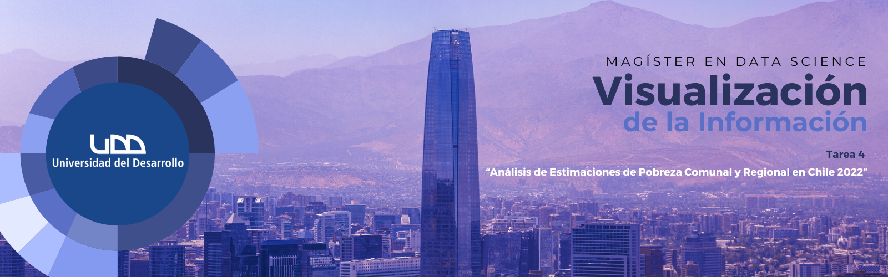

# TAREA 4: ANÁLISIS DE ESTIMACIONES DE POBREZA COMUNAL Y REGIONAL EN CHILE 2022

   
   
   

En este repositorio se aborda una tarea grupal realizada en la asignatura de Visualización de la Información. La tarea consiste en elegir un conjunto de datos, explorar y familiarizarse con el dataset, elegir la narrativa que se comunicará, definir la(s) representación(es) que mejor comunican el mensaje que se quiere transmitir, y desarrollar una visualización de datos en formato de ensayo visual explicativo en notebook jupyter.
